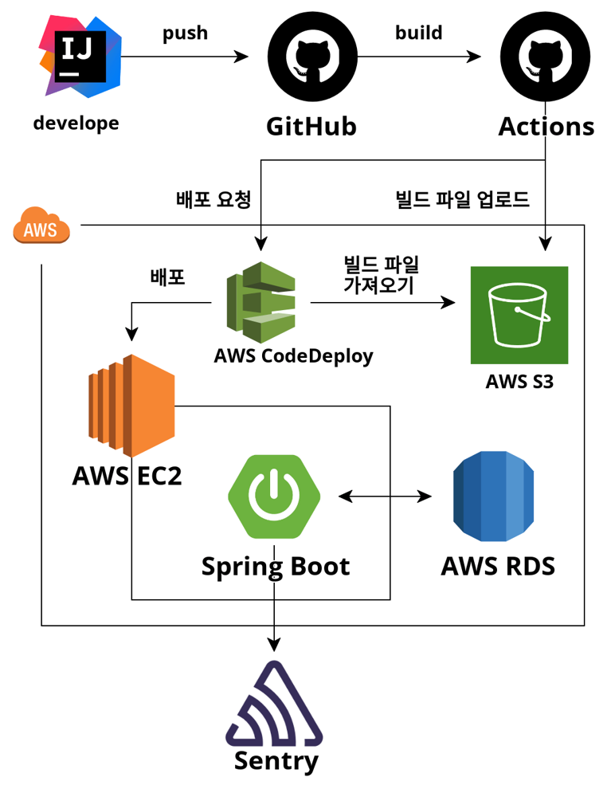
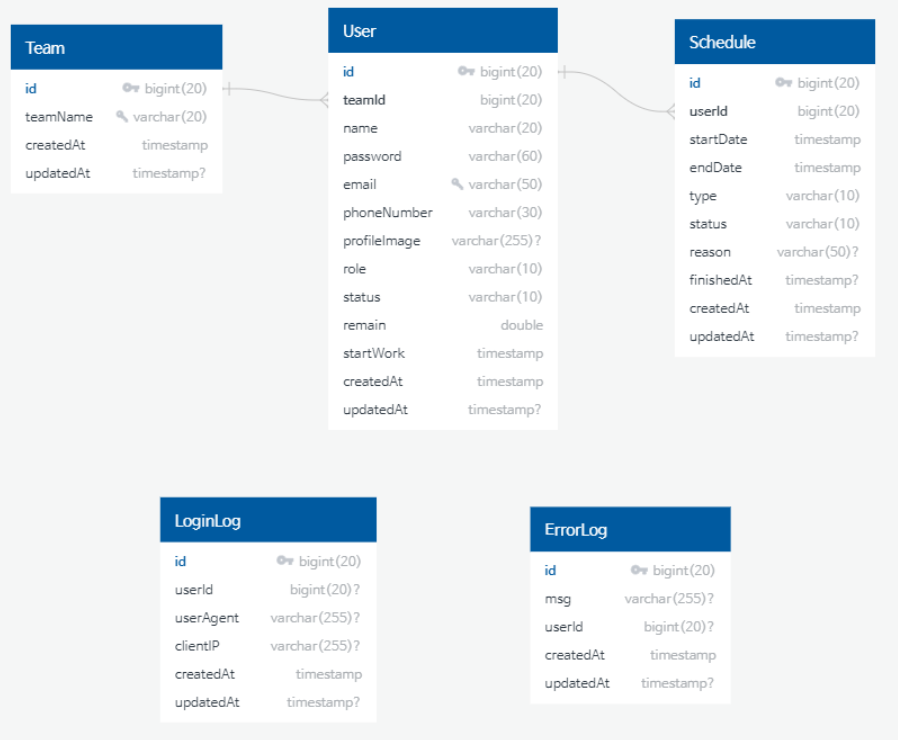

<h1 align="center">Welcome to Smash Team-Server 👋</h1>
<p>
  
  <a href="https://github.com/kefranabg/readme-md-generator/graphs/commit-activity" target="_blank">
    
  </a>
  <a href="https://github.com/wupitch/wupitch-server/blob/main/LICENSE" target="_blank">
    
  </a>
</p>

> Smash Team Back-End Server with Front-End Project

<p align="center">

</p>
<h2 align=center>연차, 당직을 "때려"버리는 근태관리 플랫폼 서비스, Team SMASH</h2>

## UI
### ✋ 로그인, 회원가입 페이지 구성 - 수정필요
<table>
<th style={{width: "25%"}}>
  <div style={{width: "50%"}}>
    
  </div>
  <div align="center">
 ✋ 로그인 또는 회원가입 권유 페이지
  </div>
</th>
 
 <th style={{width: "25%"}}>
  <div style={{width: "50%"}}>
    
  </div>
  <div align="center">
 ✋ 로그아웃
  </div>
</th>
</table>

<table>
<th style={{width: "25%"}}>
  <div style={{width: "50%"}}>
    
  </div>
  <div align="center">
 ✋회원가입 페이지
  </div>
</th>
 
 <th style={{width: "25%"}}>
  <div style={{width: "50%"}}>
    
  </div>
  <div align="center">
 ✋개인정보수 페이지
  </div>
</th>
</table>

<br/>

---
<br/>

### ✋ Side Bar - 네비게이션 페이지 구성
<table>
<th style={{width: "25%"}}>
  <div style={{width: "50%"}}>
    
  </div>
  <div align="center">
 ✋ 전체 일정보기
  </div>
</th>

<th style={{width: "25%"}}>
  <div style={{width: "50%"}}>
    
  </div>
  <div align="center">
 ✋ 연차/반차신청하기
  </div>
</th>
</table>

<table>
<th style={{width: "25%"}}>
  <div style={{width: "50%"}}>
    
  </div>
  <div align="center">
 ✋ 당직신청하기
  </div>
</th>
 
 <th style={{width: "25%"}}>
  <div style={{width: "50%"}}>
    
  </div>
  <div align="center">
 ✋ 연반차/당직 내역보기
  </div>
</th>
</table>
<br/>

---
<br/>

### ✋ 어드민과 매니저 - 멤버권한, 관리자 페이지 구성
<table>
<th style={{width: "25%"}}>
  <div style={{width: "50%"}}>
    
  </div>
  <div align="center">
 ✋ admin - 유저권한 설정하기
  </div>
</th>
 
 <th style={{width: "25%"}}>
  <div style={{width: "50%"}}>
    
  </div>
  <div align="center">
 ✋ 연반차/당직 내역보기
  </div>
</th>
 </table>

 <table>
<th style={{width: "25%"}}>
  <div style={{width: "50%"}}>
    
  </div>
  <div align="center">
 ✋ 승인권한 유저 - 연반차,당직 관리하기 신청중 목록
  </div>
</th>

<th style={{width: "25%"}}>
  <div style={{width: "50%"}}>
    
  </div>
  <div align="center">
 ✋ 승인권한 유저 - 연반차,당직 관리하기 완료 목록
  </div>
</th>
</table>

<br/>

## API Docs

### 💎 [REST - API 명세서]([api-docs.html](build%2Fdocs%2Fasciidoc%2Fapi-docs.html))


## 기술스택

<p>
  
  
   
  
  
  
</p>
<p>
   
  
  
</p>
<p>
  
  
  
  
  
</p>
<p>
  
  
   
   
  
</p>

## 개발환경

- #### backend
    - java-11
    - gradle
    - spring-boot 2.7.9

## 시스템 구성도



## Usage

```sh
$ ./gradlew clean build
```

## ERD



## 개발일지
👤 **dltmdalssssss**
- 백엔드 프로젝트 생성 (21/10/13) - `commit` : [9100388](https://github.com/smash-teams/smash-teams-BE/commit/9100388cd4ee3121a49b838409e15b5848ca9a49)

---
👤 **realgreatcode**
- 유저 스케쥴 조회 구현 완료 (21/10/13) - `commit` : [3e27392](https://github.com/smash-teams/smash-teams-BE/commit/3e273928403b0ad8fa0b720acddf77491f171fa8)

---
👤 **Jason_song97**
- 전체 스케줄 조회 구현 및 서비스, 레포지토리 테스트 완료 (23/5/7) - `commit` : [d793af5](https://github.com/smash-teams/smash-teams-BE/commit/d793af550c6dbef9c00d7668ac3756b923bf82f3)
- 유저 컨트롤러 테스트 완료 (23/5/8) - `commit` : [ca187db](https://github.com/smash-teams/smash-teams-BE/commit/ca187dbf49de298c9c7c051b9948de8a97e9c7d1)
- 내 개인 정보 수정 기능 완료 (23/5/9) - `commit` : [8401349](https://github.com/smash-teams/smash-teams-BE/commit/8401349a5cad098dd39606c08d7f88596966a51e)
- 내 개인 정보 수정 통합 테스트 완료(성공, 실패) (23/5/10) - `commit` : [6877b5d](https://github.com/smash-teams/smash-teams-BE/commit/6877b5df23a0e484ffc38475347c7fa160e50ec2)
- 이미지 업로드 기능 구현 (23/5/11) - `commit` : [5f099f4](https://github.com/smash-teams/smash-teams-BE/commit/5f099f4b88dc1d9fe8c0a2f0951bd4b5084a4ba4)
- 이미지 업로드 서비스 테스트 완료 (21/10/13) - `commit` : [507024b](https://github.com/smash-teams/smash-teams-BE/commit/507024b3101d863c89f56cf3a0c1539294192021)
- 회원 REST-API 명세서 (23/5/12) - `commit` : [d51c7bd](https://github.com/smash-teams/smash-teams-BE/commit/d51c7bdf976d8dc039db248ec92c8a97fe60785b)
- 관리자 REST-API 명세서 (23/5/12) - `commit` : [8549334](https://github.com/smash-teams/smash-teams-BE/commit/8549334fb1e823fd21bdc406b67e519025dd2311)
- 스케줄 REST-API 명세서 (23/5/12) - `commit` : [d5009cb](https://github.com/smash-teams/smash-teams-BE/commit/d5009cbdb11998b8f21389fa148de5b4cf5ceaff)
- 이미지 업로드 DTO 추가 (23/5/14) - `commit` : [806c5f4](https://github.com/smash-teams/smash-teams-BE/commit/806c5f4f4f21a12d03d0c6af189d7a2ad7d87ca6)
- DTO 오류 해결 (23/5/15) - `commit` : [4ae8313](https://github.com/smash-teams/smash-teams-BE/commit/4ae8313b4902d4efed6ee9dac1d1c692818425cb)
- 이미지 업로드 통합 테스트 코드 (23/5/15) - `commit` : [fdc312c](https://github.com/smash-teams/smash-teams-BE/commit/fdc312c3d2f5a7e36d12a474abb38bf69fcb7e25)
- RestDoc 빌드 후 생성 (23/5/15) - `commit` : [2e591fa](https://github.com/smash-teams/smash-teams-BE/commit/2e591faacfae60372e769fca0652787f83b1ccee)
- 개인정보 에러 해결 (23/5/16) - `commit` : [175fa46](https://github.com/smash-teams/smash-teams-BE/commit/175fa46c7cd4cb0f2317f57df624624048b4be13)
- 리드미 작성 (23/5/16) - `commit` : [4cf3de9](https://github.com/smash-teams/smash-teams-BE/commit/4cf3de9e07b00a79eb1443cd8838dca402d0839c)


## Author

👤 **dltmdalssssss**

* Website: dltmdalssssss.github.io
* Github: [@dltmdalssssss](https://github.com/dltmdalssssss)

👤 **realgreatcode**

* Website: realgreatcode.github.io
* Github: [@realgreatcode](https://github.com/realgreatcode)

👤 **Jason_song97**

* Website: Jason_song97.github.io
* Github: [@Jason_song97](https://github.com/JasonSong97)

## 🤝 Contributing

Contributions, issues and feature requests are welcome!<br />Feel free to check [issues page](https://github.com/vividswan/K.Cook-Server/issues).

## Show your support

Give a ⭐️ if this project helped you!

## 📝 License

Copyright © 2023 [team-smash](https://github.com/smash-teams/smash-teams-BE).<br />
This project is [MIT](https://github.com/wupitch/wupitch-server/blob/main/LICENSE) licensed.

***
_This README was generated with ❤️ by [readme-md-generator](https://github.com/kefranabg/readme-md-generator)_
