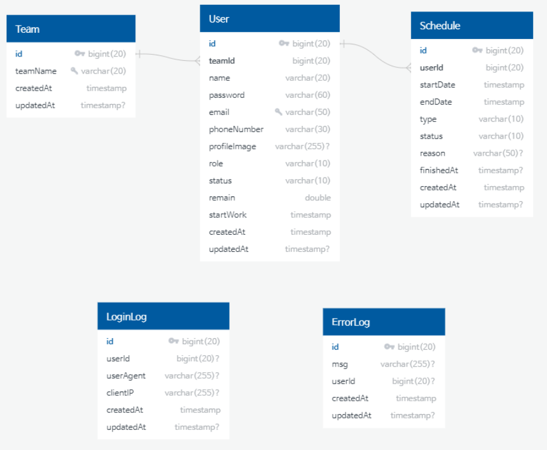

<h1 align="center">Welcome to Smash Team-Server 👋</h1>
<p>
  
  <a href="https://github.com/kefranabg/readme-md-generator/graphs/commit-activity" target="_blank">
    
  </a>
  <a href="https://github.com/wupitch/wupitch-server/blob/main/LICENSE" target="_blank">
    
  </a>
</p>

> Smash Team Back-End Server with Front-End Project

<p align="center">

</p>
<h2 align=center>연차, 당직을 "때려"버리는 근태관리 플랫폼 서비스, Team SMASH</h2>


## API Docs

### 💎 [REST - API 명세서](..%2F..%2FUsers%2Fuser%2FDownloads%2Fapi-docs%20%283%29.html)


## 기술스택

<p>
  
  
   
  
  
  
</p>
<p>
   
  
  
</p>
<p>
  
  
  
  
  
</p>
<p>
  
  
   
   
  
</p>

## 개발환경

- #### backend
    - java-11
    - gradle
    - spring-boot 2.7.9

## 시스템 구성도


## Usage

```sh
$ ./gradlew clean build
```

## ERD



## 개발일지


## Author

👤 **dltmdalssssss**

* Website: dltmdalssssss.github.io
* Github: [@dltmdalssssss](https://github.com/dltmdalssssss)

👤 **realgreatcode**

* Website: realgreatcode.github.io
* Github: [@realgreatcode](https://github.com/realgreatcode)

👤 **Jason_song97**

* Website: Jason_song97.github.io
* Github: [@Jason_song97](https://github.com/JasonSong97)

## 🤝 Contributing

Contributions, issues and feature requests are welcome!<br />Feel free to check [issues page](https://github.com/vividswan/K.Cook-Server/issues).

## Show your support

Give a ⭐️ if this project helped you!

## 📝 License

Copyright © 2023 [team-smash](https://github.com/smash-teams/smash-teams-BE).<br />
This project is [MIT](https://github.com/wupitch/wupitch-server/blob/main/LICENSE) licensed.

***
_This README was generated with ❤️ by [readme-md-generator](https://github.com/kefranabg/readme-md-generator)_